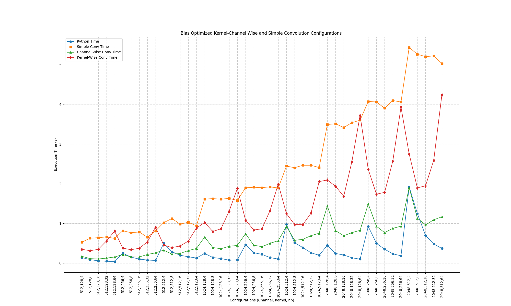
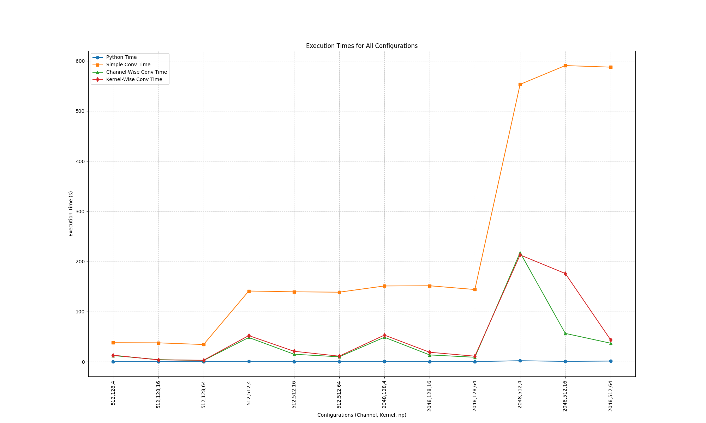
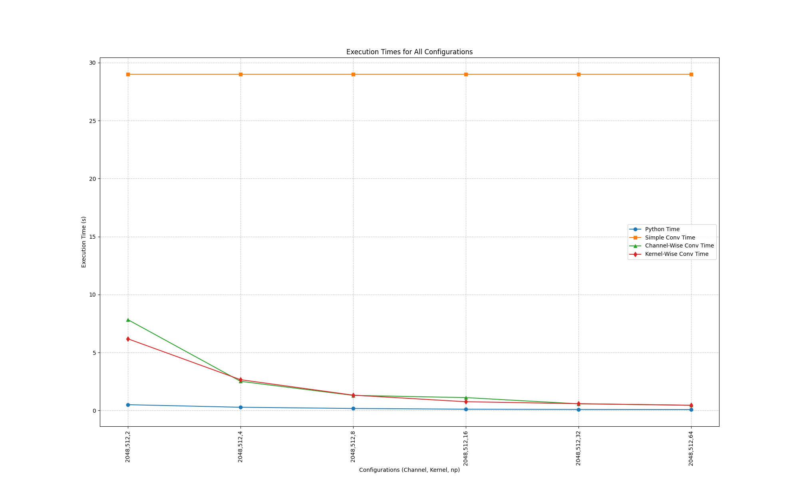
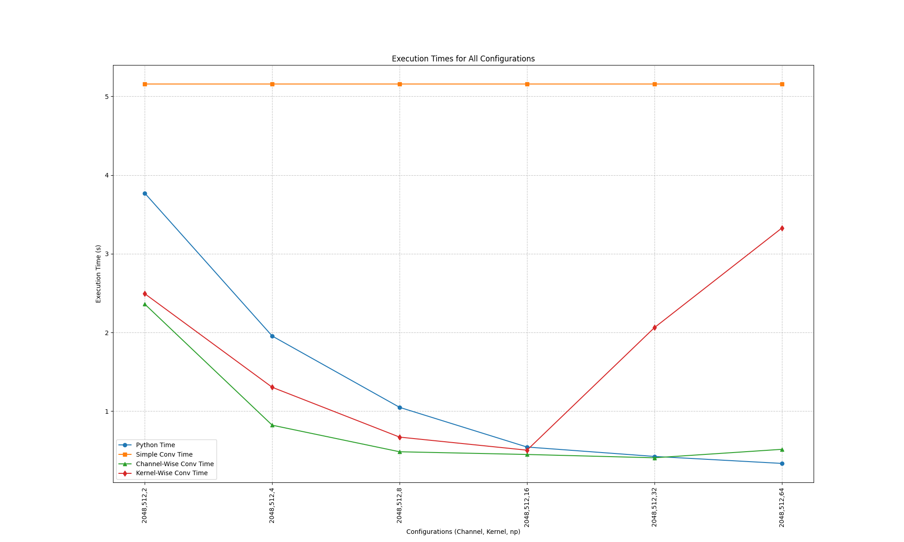
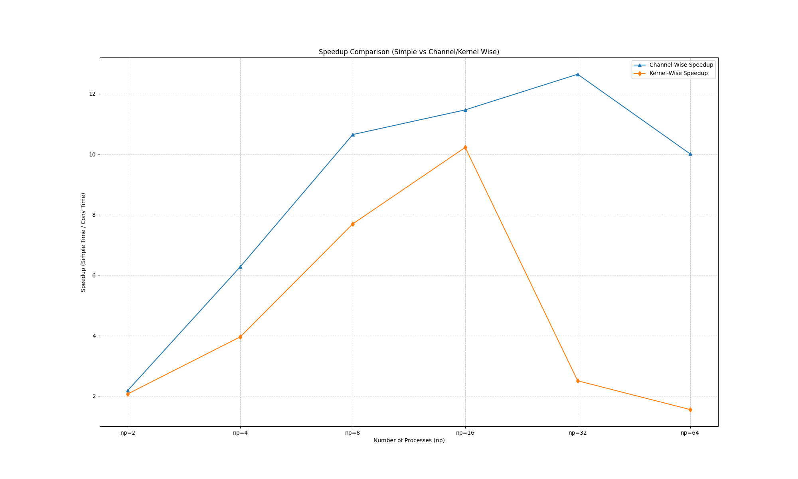
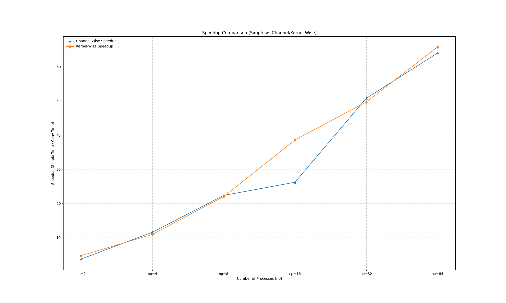

# OpenMPI Convolution Operations

## Overview 
This repository contains implementations of convolution operations using OpenMPI to demonstrate the efficiency of parallel computing. The code is organized into several C programs that perform channel-wise and kernel-wise convolutions, optimized with BLAS for enhanced performance.

## Features
Channel-wise Convolution: Distributes image channels across MPI nodes.  
Kernel-wise Convolution: Distributes convolution kernels across MPI nodes.  
Performance Comparison: Python scripts to compare execution times and efficiency.  

## Dependencies
MPI (Message Passing Interface)  
BLAS (Basic Linear Algebra Subprograms)  

## Getting Started  
To run the programs, clone this repository and use the provided shell scripts:  

    git clone https://github.com/ardacekic/openMPIConv  
    cd openMPIConv  

You can use WindowConvolution to generate results for Basic Window Convolution Version
    cd WindowConvolution
    python3 pipe_window.py

You can use Im2ColBLASConvolution to generate results for BLAS optimized Version

    cd WindowConvolution
    python3 pipe_window.py

In each file you can change pipe script to use for different channel-kernel-processes options also you can change kernel and input sizes as well. 

    Default input size 64x64xC and kernel size Nx3x3xC, stride 1, padding 0 assumed for Densest Layer of Resnet50

## Results 
Blas Optimized Version of MPI vs Python(PyTorch) Metrics

Window Convolution Version of MPI vs Python(PyTorch) Metrics

Window Convolution Version of MPI vs Python(PyTorch) Metrics Densest Layer 

Blas Optimized Version of MPI vs Python(PyTorch) Metrics Densest Layer 

Blas Optimized Version of MPI vs Python(PyTorch) Metrics Densest Layer Speedup

Window Convolution Version of MPI vs Python(PyTorch) Metrics Densest Layer  Speedup

## Contribution 
Contributions are welcome. Please fork the repository and submit pull requests with your enhancements.
